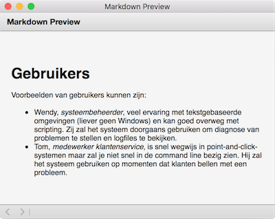

# Markdown

Als je een tekst publiceert hoort daar een bepaalde *opmaak* bij. De regellengte wordt bijvoorbeeld beperkt zodat de tekst op een bladzijde past. Al sinds de introductie van de personal computer gebruiken we *WYSIWYG*-programma's om tekst op te maken: what you see is what you get. Als je een document maakt in Word, dan kun je een stuk tekst selecteren en met één druk op de knop "vet" maken. Op het scherm, maar ook op een printje, zal dat vetgedrukte tekst opleveren.

HTML is oorspronkelijk een taal om teksten mee op te maken. Het werkt niet *WYSIWYG*, maar je zet middenin de tekst speciale commando's om de opmaak te specificeren. Het voordeel is dat de schrijver of ontwerper volledige controle heeft over de opmaak, maar vooral dat de opmaakcommando's leesbaar zijn door een computer (het is een voorbeeld van een *markuptaal*). Het nadeel is dat al die commando's er niet heel prettig uitzien en dat je tijdens het schrijven het overzicht sneller kwijtraakt.

Als tegenwicht van markuptalen zijn er diverse taaltjes ontwikkeld waarin tekst "opgemaakt" kan worden in op een manier die niet onprettig is om te lezen, maar tegelijk automatisch vertaald kan worden naar bijvoorbeeld een HTML-document om te publiceren. Eén van die talen is Markdown. Een document kan er zo uitzien:

    # Gebruikers

    Voorbeelden van gebruikers kunnen zijn:

    - Wendy, *systeembeheerder*, veel ervaring met tekstgebaseerde omgevingen (liever
      geen Windows) en kan goed overweg met scripting. Zij zal het systeem doorgaans
      gebruiken om diagnose van problemen te stellen en logfiles te bekijken.

    - Tom, *medewerker klantenservice*, is snel wegwijs in point-and-click-systemen
      maar zal je niet snel in de command line bezig zien. Hij zal het systeem
      gebruiken op momenten dat klanten bellen met een probleem.

Als we deze Markdown-tekst vertalen naar HTML en in een webbrowser openen, dan zie je dat de tekst in Markdown al erg lijkt op de tekst zoals deze er na publicatie uitziet:

## Github README en markdown

Wanneer je je GitHub repository opent in je browser krijg je een tabel te zien met de folderstructuur en ook een gerenderde versie van `README.md` (als deze in de map zit waar je op het moment naar kijkt). Iedere GitHub folder zal een file genaamd `README.md` laten zien als je het opent in je browser.

READMEs bevatten vaak:

- Een beschrijving van het project of de folder waar deze README in staat
- Een beschrijving van de (sub)structuur van de repository
- Een lijst van gebruikte modules, libraries, of programma's die nodig zijn om de code in dit project te runnen
- Een beschrijving van hoe de code in dit project gebruikt kan worden **of** een kort voorbeeld of referentie naar een voorbeeld van hoe je de code kan gebruiken
- Een lijst met auteurs

Een voorbeeld hiervan kan je vinden op [deze pagina](https://github.com/minprog/radio_russia_demo/tree/college_2). Wanneer je een folder hebt waarin een hoop voorbeelden, grafieken, of andere dingen staan die je wilt laten zien of uitleggen kan je een README in die folder zetten.

## Naslag

Zoals je ziet kun je met `#` (hekjes) een kopje maken in de tekst. Maar er is nog een manier om dat te doen! En hoe kun je een genummerde lijst maken? Zie daarvoor de documentatie:

<http://daringfireball.net/projects/markdown/>

Je Markdown-document ga je later ook nog op GitHub plaatsen, en daar kun je ook nog wat extra features gebruiken. Zie daarvoor:

<https://guides.github.com/features/mastering-markdown/>

En ook:

<https://github.com/adam-p/markdown-here/wiki/Markdown-Cheatsheet>

## Plaatjes

Zodra je document op GitHub staat kun je ook plaatjes invoegen. Als je je plaatjes in een map genaamd `doc` zet, dan kun je deze als volgt invoegen in je document:

    
