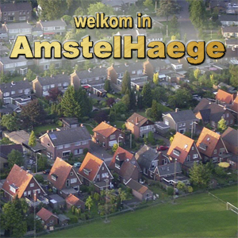

# Case: Amstelhaege
{:.inline}

Na jarenlang getouwtrek is de knoop eindelijk doorgehakt: er komt een nieuwe woonwijk in de Duivendrechtse polder, net ten noorden van Ouderkerk aan de Amstel. De huisjes zijn bedoeld voor het midden- en bovensegment van de markt, met name expats en hoogopgeleide werknemers actief op de Amsterdamse Zuidas.

Omdat de Duivenderechtse polder ooit beschermd natuurgebied was, is de compromis dat er alleen lage vrijstaande woningen komen, om zo toch het landelijk karakter te behouden. Dit, gecombineerd met een aantal strenge restricties ten aanzien van woningaanbod en het oppervlaktewater, maakt het een planologisch uitdagende klus. De gemeente overweegt drie varianten: de 20-huizenvariant, de 40-huizenvariant en de 60-huizenvariant. Er wordt aangenomen dat een huis meer waard wordt naarmate de vrijstand toeneemt, de rekenpercentages zijn per huistype vastgesteld.

## Requirements voor de wijk
1. De wijk komt te staan op een stuk land van 180x160 meter (breed x diep). Er wordt door de planologen gerekend in hele meters.
2. Het aantal woningen in de wijk bestaat voor 60% uit eengezinswoningen, 25% uit bungalows en 15% uit maisons.
3. Een eengezinswoning is 8x8 meter (breed x diep) en heeft een waarde van €285.000,- De woning heeft rondom twee meter vrijstand nodig; iedere meter extra levert een prijsverbetering op van 3%.
4. Een bungalow is 11x7 meter (breed x diep) en heeft een waarde van €399.000,-. De woning heeft rondom drie meter vrijstand nodig, iedere meter extra levert een prijsverbetering op van 4%.
5. Een Maison is 12x10 meter (breed x diep) en heeft een waarde van €610.000,- De woning heeft rondom zes meter vrijstand nodig, iedere  meter extra levert een prijsverbetering op van 6%.
6. De vrijstand van een woning is de kleinste afstand tot de dichtstbijzijnde andere woning in de wijk. Oftewel, voor een vrijstand van 6 meter moeten alle andere woningen in de wijk op minimaal 6 meter afstand staan. Deze afstand is bepaald als de kortste afstand tussen twee muren, dus niet vanuit het centrum van de woning.
7. De verplichte vrijstand voor iedere woning moet binnen de kaart vallen. Overige vrijstand mag buiten de kaart worden meegerekend.
8. In geval van percentuele waardevermeerdering per meter is de toename niet cumulatief. Een maison met twee meter extra vrijstand is dus 12.0% meer waard, niet 12.36%.
9. De wijk bestaat voor een deel uit oppervlaktewater. Huizen mogen niet op het water worden geplaatst, maar hun vrijstand mag daar wel op vallen (zowel de verplichte als die voor de waarde berekening).

## Opdracht
In [wijken.zip](wijken.zip) tref je 3 verschillende csv's aan. 
Elke csv beschrijft de plaatsing van het oppervlaktewater in de bijbehorende wijk. 
Hiervan worden de plaatsing van het linkeronderpunt en rechterbovenpunt gegeven als x,y coordinaten.

1. Lever allereerst voor wijk_1 een plattegrond af voor de kleinste huizenvariant van de nieuw te bouwen wijk Amstelhaege. De huizen mogen willekeurig, handmatig, of door een slim algoritme worden geplaatst.
2. Visualiseer je plattegrond en kijk goed of de plaatsing wel aan de requirements voldoet (zijn alle huizen geplaatst? voldoet de plaatsing aan de verplichte vrijstand?)
3. Stel vervolgens een doelfunctie op, die de waarde van ieder huis kan bepalen aan de hand van de vrijstand om elk huis heen. Bereken hiermee de waarde van de plattegrond.
4. Lever vervolgens voor alle wijken een plattegrond (2D of 3D) af voor ieder van de drie huizenvarianten voor de nieuw te bouwen wijk Amstelhaege. De score voor een plattegrond is de opgetelde waarde van alle huizen in de wijk.

## Advanced
Een groter budget staat nu toe om zelf oppervlaktewater aan te leggen. De wijk moet voor 20% uit oppervlaktewater bestaan, opgedeeld in niet meer dan vier lichamen die rechthoekig of ovaal van vorm zijn. Om de wijk aantrekkelijk te houden, moeten de lichamen een hoogte-breedteverhoudingen tussen de 1 en de 4 liggen. Geen lange dunne slootjes dus! Huizen mogen niet op het water worden geplaatst, maar hun vrijstand wel.

{:start="5"}
5. Wat is de maximale waarde die je kunt bereiken met een zelfgekozen verdeling en plaatsing van het water?

## Output
Om resultaten te kunnen verifiëren is het handig om in een uniform format je output te genereren.
Bekijk [het voorbeeld](example_output.csv) en zorg ervoor dat jouw programma een oplossing in hetzelfde format kan omzetten.
Een vereiste aan de output zijn de header-regel (regel 1) en de footer-regel (regel 23). 
Deze moeten in jouw output ook voorkomen, waarbij alleen het getal voor de networth zal verschillen.

N.B. Je programma hoeft hier verder niets mee te doen. Het programma hoeft dit enkel als laatste stap in het process te kunnen doen.

## Check50
Je kan je programma's testen door de output mee te geven aan de check50. Dit kan in drie eenvoudige stappen:

1. Genereer een antwoord en sla deze met het bovenstaande formaat op in een nieuw bestand met de naam `output.csv`
2. Open een terminal in de folder waar je `output.csv` hebt opgeslagen
3. Run het commando `check50 minprog/theorie-check50/master/amstelhaege`

De check50 is zo geschreven dat je de huizen vrij kan draaien en plaatsen.
Dit betekent dat er niet wordt gecheckt of je de plaatsing volgens het grid heb gedaan, met daarbij alleen draaïngen van 90 graden.
Hierdoor heb je meer vrijheid in het vinden van oplossingen, maar tevens zal je algoritme ook een stuk trager worden.

## Links
* Een moderne [nieuwbouwwijk](https://delubouw.nl/wp-content/uploads/2018/10/header-delubouw-1NIEUW.jpg)
