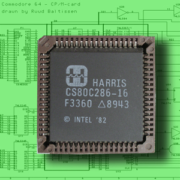
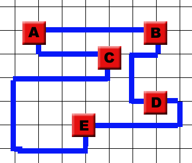
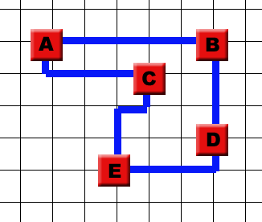
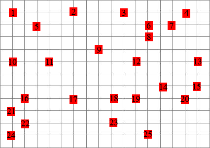
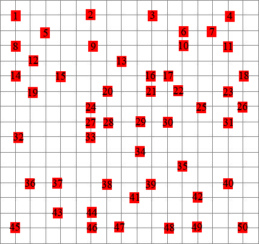

# Case: Chips and Circuits

{:.inline}

Chips (or more precisely: *integrated circuits*) are found in your PC, MacBook, Android Phone and microwave oven where they perform a diversity of functions, ranging from timekeeping and motor control to arithmetic and logic. Basically a small plate of silicon, chips are usually designed logically and subsequentially transformed to a list of connectable gates. This list, commonly known as a *netlist* is finally transformed into a 2-dimensional design on a silicon base.

This last step however, the physical real-world process of connecting the gates, is highly volatile. Good arrangements with short nets lead to faster circuits, whereas poor arrangements with long nets lead to slower circuits. Besides, shorter nets are cheaper than long nets, so there is no doubt that a good arrangement of logical gates and short nets between them is of vital importance, both economically and performancewise.

To make things easier, we will consider the wiring problem only. The gates have already been arranged, and all it takes is finding very short wiring patterns.

## Example
 Netlist #1
 A suboptimal wiring for netlist #1.
 An optimal wiring for netlist #1.

This is an integrated circuit built up from five gates that need to be connected. The connections ("nets") follow the grid in a Manhattan style. Luckily enough, the wires don't cross. Sometimes if there is no other option then to have them cross, the base can be made up out of of multiple grid layers. Besides going North, South, East and West, nets can also go Up and Down, and the distance between levels is identical to the distance between grid points.

## Assignment

Print #1 and Print #2 are arrangements of gates on a base, and all it takes is to wire the appropriate gates together. There are three netlists (in [csv-format](gates&netlists.zip)) for each print. Each netlist needs to be implemented. Nets can only follow the grid, as well as the edges of the grid, and one step costs 1 unit length. Wires may neither run along the same grid segment, nor can they cross at an intersection (they're not allowed to touch!). Nets that are aligned along the same grid line are said to be in _collision_. If there is one collision in one arrangement, the circuit cannot be used. Nets can also go up and down to lower and higher layers, also at the cost of 1 per level. The assignment is to implement all nets in all netlists at minimum cost.

A few steps to pave the way towards a program:

1) Build a computer program that holds a data structure for a grid with fixed gates. 

2) Expand your program by making a data structure for a netlist. Make sure it holds a few nets, and that the program has a cost function to calculate the total wire length.

3) Add 7 more layers by stacking them on top of the base layer. Try to get all the nets in. You can either build up wire-by-wire, or remove collisions one by one. 

4) Try to get all the nets in with minimal costs. Record all your results, so you can present them later.

## Advanced

* Randomly generate some new netlists. They should be of equal length to the original netlists. Which are solvable, which aren't? Which have good solutions, which haven't?

* For each of the three arrangements, try to determine the relation between the number of wires and the required number of layers.

## Output

To be able to verify the results of your program it is useful to be able to generate output in a uniform format.
Take a look at [the example](example.zip) and make sure your program can transform a solution into the same output.
Note that your program does not have to use or rely on this output. This is solely a conversion of the representation of your solution as a final step.
