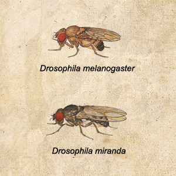
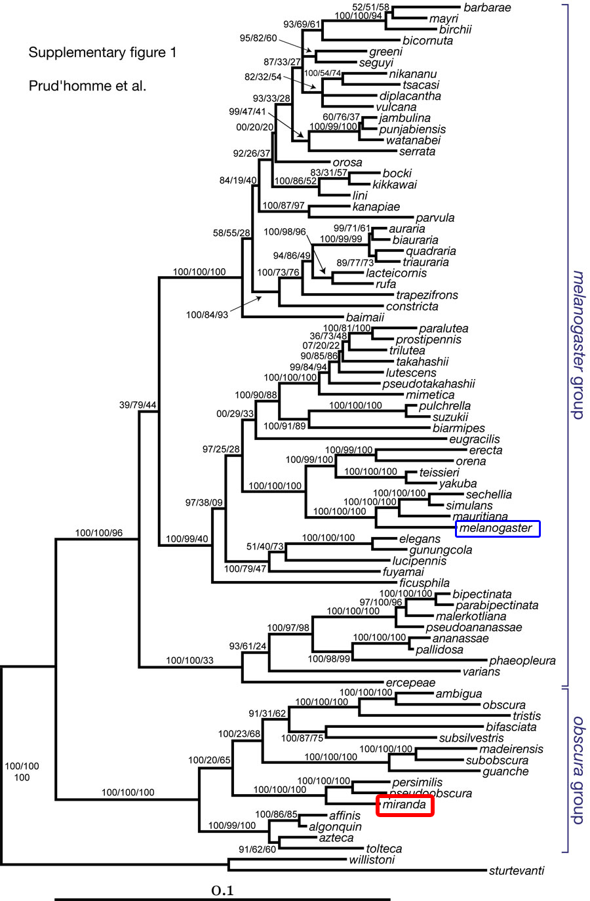

## Inleiding

Drosophila Melanogaster en Drosophila Miranda zijn fruitvliegsoorten waarvan het genoom goed bestudeerd is. Voor deze twee soorten geldt dat de genen  voor beide soorten identiek zijn, maar wel in een andere volgorde staan. Mutaties in de genenrij van de Drosophila vinden alleen plaats doordat subrijen ervan in hun geheel omkeren (fig.2 ). In deze opdracht is het zaak te achterhalen welke reeks van achtereenvolgende mutaties de ene fruitvliegensoort in de andere heeft doen veranderen. Misschien zijn er meerdere reeksen mogelijk; in dat geval willen we de meest plausibele reeks vinden: die met de kleinste mutaties en die met de minste mutaties.

## Opdracht

 Fig.1: Genomen van D.Melanogaster (boven) en D.Miranda (onder). Beide genomen bestaan uit dezelfe genen, alleen de volgorde verschilt.

Fig.2: Mutatie zoals die plaats vindt binnen de soort Drosophila. Een gedeelte van het genoom keert ineens om.

1. Bepaal een sequentie van mutaties dat het genoom van D. Melanogaster in het genoom van D. Miranda verandert. Bepaal ook de grenzen van de oplossingskwaliteit en de toestandsruimte.

2. Vind de "kortste" sequentie van mutaties dat het genoom van D. Melanogaster in het genoom van D. Miranda verandert. Als er meerdere kortste oplossingen zijn, vergelijk ze dan met elkaar.

Er is een theorie, die stelt dat kleine mutaties waarschijnlijker zijn dan grote mutaties. Een manier omdat te modelleren is om mutatiepunten te geven aan mutaties. Het aantal punten is de lengte van het stuk dat omkeert.

{:start="3"}
3. Schrijf een algoritme dat het genoom van D. Melanogaster in het genoom van D. Miranda verandert, in zo min mogelijk mutatiepunten.
4. Een alternatieve formule geeft ½n1.3 mutatiepunten voor mutaties van lengte n. Grote mutaties worden zo dus "nog" onwaarschijnlijker. Zoek wederom naar een mutatiesequentie die het genoom van D. Melanogaster in het genoom van D. Miranda verandert in zo min mogelijk mutatiepunten.
5. Maak een test-set met 100 random-volgorde genomen van lengte 25. Sorteer ze met je algoritmes en probeer zicht te krijgen op het minimale aantal mutatiepunten dat nodig is om een genoom gesorteerd te krijgen. Probeer wederom een boven- en ondergrens vast te stellen als je kunt.
 
## Advanced

{:start="6"}
6. Probeer te formaliseren wat voor genomen ''veel'' mutatiestappen nodig hebben om gesorteerd te worden met a), en wat voor genomen ''weinig'' stappen.

7. Als er bij b) meerdere kortste paden gevonden zijn, willen we graag weten wat de overeenkomst daartussen is. Ingewikkeld! 

## Familiestamboom

Er is een philogenie (familiestamboom) van de familie fruitvlieg uitgetekend, zie de figuur. 

