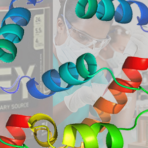
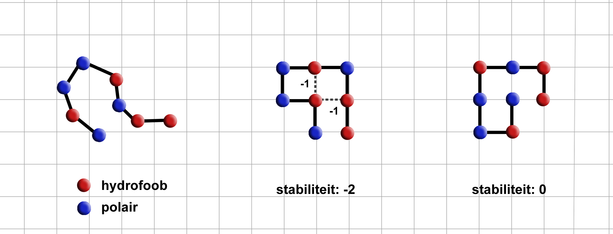

## Inleiding

Eiwitten zijn lange strengen van aminozuren die veel belangrijke processen in het menselijk lichaam beregelen. Het is bekend dat eiwitten 'opgevouwen' in de lichaamscellen opgeborgen zitten, en dat de specifieke vouwing bepalend is voor het functioneren; verkeerd gevouwen eiwitten staan aan de basis van onder andere kanker, Alzheimer en taaislijmziekte. Het is daarom van groot belang voor zowel de farmaceutische industrie als de medische wetenschap om iets te kunnen zeggen over de exacte vorm van de vouwing.

Nu is er is het één en ander bekend over het mechanisme: hydrofobe aminozuren (H) willen graag 'naast elkaar' liggen, polaire aminozuren (P) hebben die voorkeur niet. Als twee hydrofobe aminozuren naast elkaar liggen ontstaat er namelijk een 'H-bond' door de aantrekkende kachten tussen de twee. En hoe meer bonds, hoe stabieler het eiwit. Voor de wetenschappers en farmaceuten is het belangrijk om te weten tot welke stabiliteit van het eiwit maximaal gevouwen zou kunnen worden. Het doel is dus de gegeven eiwitten zo op te vouwen, dat ze zo stabiel mogelijk zijn.

**Links:** een eiwit van vier polaire en vier hydrofobe aminozuren. **Midden:** een relatief stabiele vouwing met twee H-bonds. **Rechts:** een onstabiele vouwing vanwege het ontbreken van H-bonds.

Om de boel enigzins beheersbaar te houden gaan we uit van een 2D grid waarbij we ieder aminozuur op een gridpunt komt te liggen. Het volgende aminozuur ligt op één van de aangrenzende gridpunten waardoor we eiwitten 'gevouwen' kunnen neerleggen, met hoeken van telkens 90 graden. Als twee H's naast elkaar op het grid liggen krijgt het totale eiwit een -1 op de score. Hoe lager de score, hoe stabieler het eiwit.

## Opdracht

1. Schrijf een algoritme dat het eiwit HHPHHHPH zo goed mogelijk vouwt. Probeer ook te kwantificeren ''hoe goed'' de vouwing is.

2. Vouw de volgende eiwitten zo goed mogelijk. Ze zijn langer, maar zijn ze ook moeilijker?

    * HHPHHHPHPHHHPH 

    * HPHPPHHPHPPHPHHPPHPH

    * PPPHHPPHHPPPPPHHHHHHHPPHHPPPPHHPPHPP

    * HHPHPHPHPHHHHPHPPPHPPPHPPPPHPPPHPPPHPHHHHPHPHPHPHH 

3. Het aminozuur Cysteine (C) heeft hele sterke bonds. Als twee Cysteine-aminozuren naast elkaar liggen krijgt het eiwit -5 op de score. Tussen C's en H's is de score -1, en met P's is er geen bindingseffect, dus score nul. Bepaal de beste vouwing.

    * PPCHHPPCHPPPPCHHHHCHHPPHHPPPPHHPPHPP

    * CPPCHPPCHPPCPPHHHHHHCCPCHPPCPCHPPHPC

    * HCPHPCPHPCHCHPHPPPHPPPHPPPPHPCPHPPPHPHHHCCHCHCHCHH

    * HCPHPHPHCHHHHPCCPPHPPPHPPPPCPPPHPPPHPHHHHCHPHPHPHH 

4. Voeg een dimensie toe. Vouw de eiwitten zo goed mogelijk in 3D.

## Advanced

{:start="5"}
5. Genereer zelf een aantal random eiwitten, en probeer te bepalen welke eigenschappen ervoor zorgen dat een eiwit makkelijk moeilijk optimaal te vouwen is.

## Links & Trivia

De eerste versie van deze case is ontwikkeld door Misha Paauw en Anneliek ter Horst in het kader van Advanced Heuristics, januari 2017.