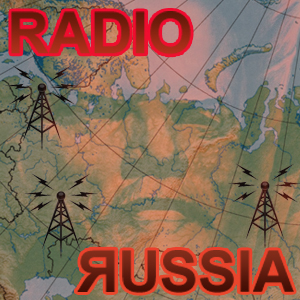
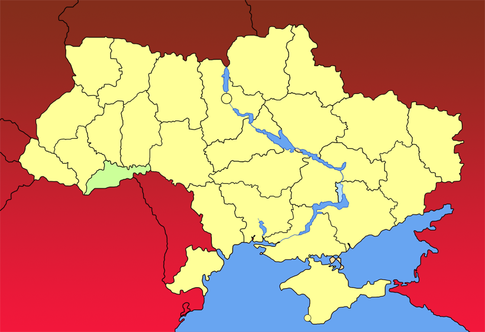
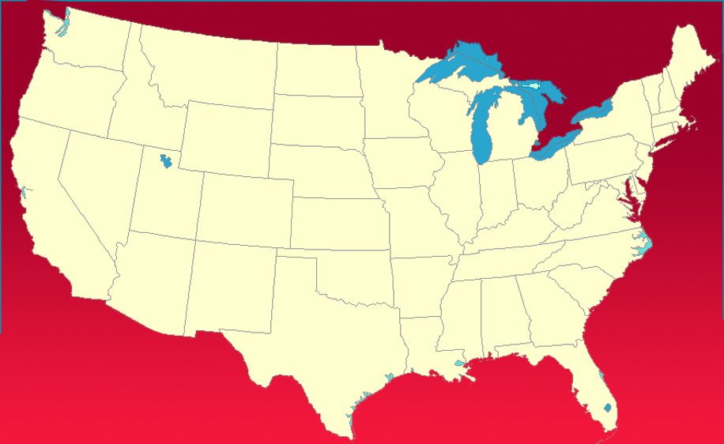
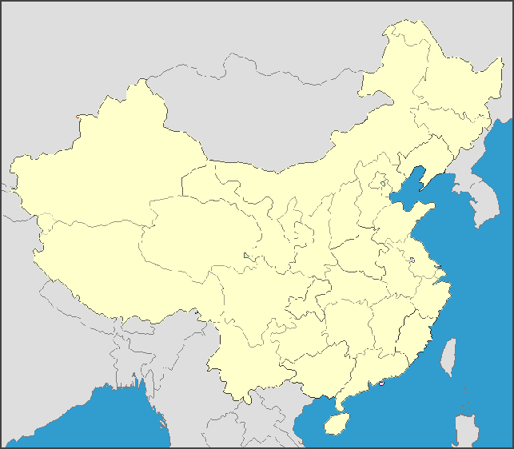
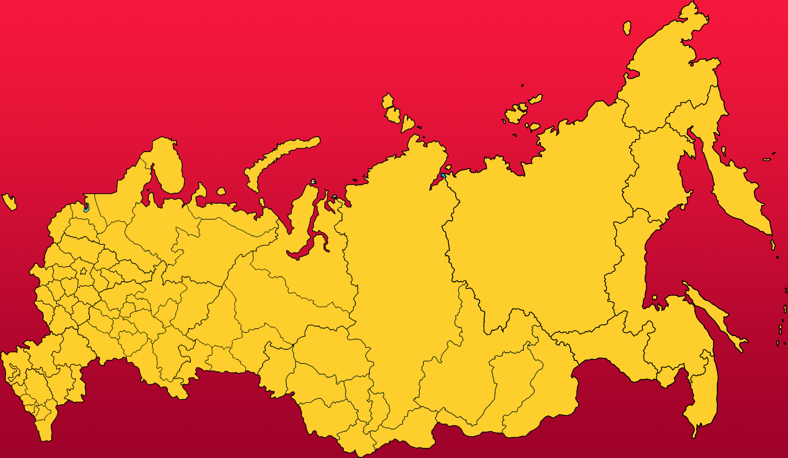

# Voorbeeld Case: Radio Russia
{:.inline}

De russische overheid wil een goede verdeling van zendfrequenties. 
Er zijn precies zeven types zendmasten beschikbaar, voor het moment bekend als type A t/m type G. 
Voor een goede verdeling is het noodzakelijk dat twee aangrenzende provincies niet dezelfde zendertypes hebben. 
Omdat wiskundigen van de russische overheid de details van de optimale oplossing niet precies kennen hebben ze ook wat kaarten van kleinere landen ter hand genomen, in de hoop het probleem wat beter te gaan begrijpen en tot een goede oplossing te komen.

## Let op
Dit is een voorbeeld case en kan dus tijdens het vak niet gekozen worden!

## Input data
De wiskundige van de russische overheid hebben [de kaarten](Kaarten.zip) op twee manieren opgeslagen. 
Voor ieder land is er in een .csv-bestand een lijst aangelegd met provincies en hun aangrenzende provcincies.
Als wiskundigen begrepen niks van de vreemde namen, dus hebben ze de provincies simpelweg vanaf 0 genummerd.
Ze hebben de provincies ook in .shp- en .shx-bestanden vastgelegd. 
Hiermee willen ze later de landen als een ingekleurde kaart weergeven en voorleggen aan de russische overheid.

## Opdracht 1
1. Verzin een zenderinrichting voor de Oekraïne. Iedere provincie moet een zendertype hebben, geen enkele twee aangrenzende provincies mogen hetzelfde zendertype hebben. Verzin een zenderinrichting voor het hele land, en hoe minder zendertypes je gebruikt, hoe beter.
2. Doe hetzelfde voor China, de USA en uiteindelijk voor moedertje Rusland. Hoe minder zenderypes, hoe beter.
3. De produktie van zenders wordt in Rusland uiteraard ook door de overheid beregeld. Het is het goedkoper om minder zendertypes te hebben, maar ook om van alle zendertypes ongeveer evenveel te hebben. Probeer voor ieder land met ieder minimumaantal zendertypes te bepalen hoe een evenwichtige verdeling eruit zou zien, en kijk of een inrichting mogelijk is met zo'n verdeling.

| Oekraïne | USA |
| --- | --- |
|  |  |

| China | Russia |
| --- | --- |
|  |  |

## Opdracht 2
Er zijn vier mogelijke kostenschema's bekend geworden. Bekijk voor ieder land welk kostenschema de voordeligste inrichting oplevert.

| Zendertype | Kosten 1 | Kosten 2 | Kosten 3 | Kosten 4 |
| --- | --- | --- | --- | --- |
| A | 12 | 19 | 16 | 3 |
| B | 26 | 20 | 17 | 34 |
| C | 27 | 21 | 31 | 36 |
| D | 30 | 23 | 33 | 39 |
| E | 37 | 36 | 36 | 41 |
| F | 39 | 37 | 56 | 43 |
| G | 41 | 38 | 57 | 58 |

## Advanced
Omdat production in numbers goedkoper is, wordt iedere geplaatste zender van een type 10% goedkoper dan de vorige van hetzelfde type. Vind, met je algoritmes, opnieuw de beste oplossing voor de landen. Hoe vergelijken ze met de oplossingen van opgaven 1 en 2?

## Output
Om resultaten te kunnen verifiëren is het handig om in een uniform format je output te genereren.
Bekijk [het voorbeeld](example_output.csv) en zorg ervoor dat jouw programma een oplossing in hetzelfde format kan omzetten.
Een vereiste aan de output zijn de header-regel (regel 1) en de footer-regel (regel 29). 
Deze moeten in jouw output ook voorkomen, waarbij alleen de footer-regel andere waardes kan bevatten.
De footer-regel is opgesteld als `<land>,<kostenschema>` waarbij het land `china`, `russia`, `ukraine` of `usa` kan zijn en het kostenschema `1`, `2`, `3` of `4` kan zijn.

N.B. Je programma hoeft hier verder niets mee te doen. Het programma hoeft dit enkel als laatste stap in het process te kunnen doen.

## Check50
Je kan je programma's testen door de output mee te geven aan de check50. Dit kan in drie eenvoudige stappen:

1. Genereer een antwoord en sla deze met het bovenstaande formaat op in een nieuw bestand met de naam `output.csv`
2. Open een terminal in de folder waar je `output.csv` hebt opgeslagen
3. Run het commando `check50 okkevaneck/check50_heuristieken/master/radio_russia`

## Trivia
Voor een lange tijd is er geen input data geweest voor deze case en moesten de studenten zelf op zoek gaan in archieven met geodata.
Deze is er in 2020 door Okke van Eck gemaakt en toegevoegd.
