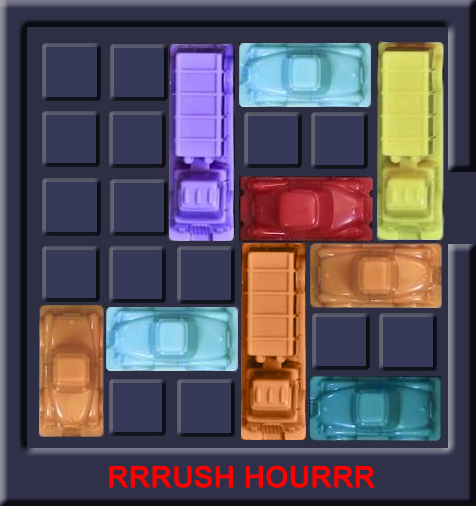
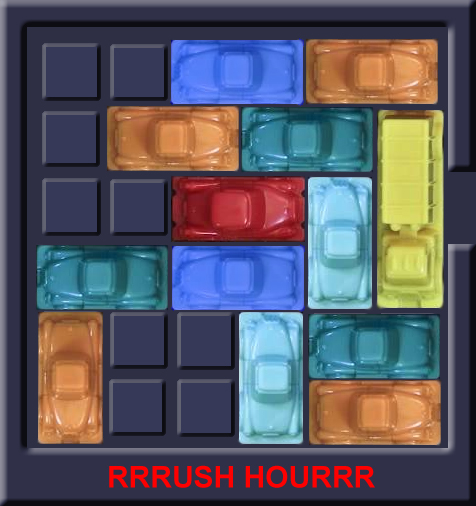
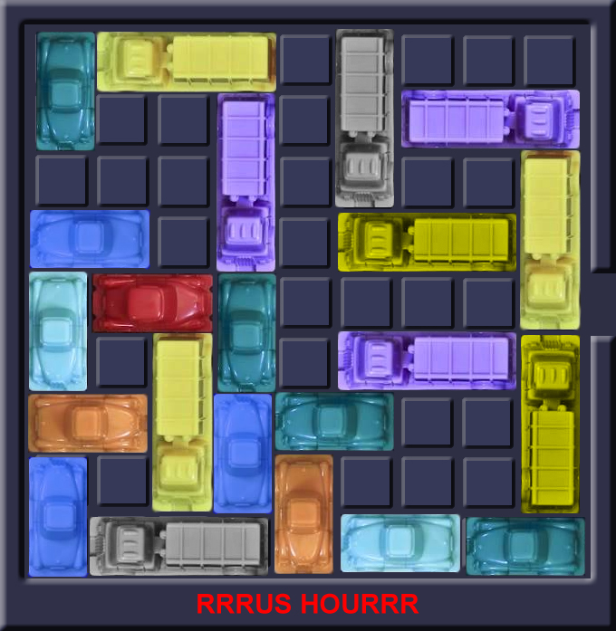
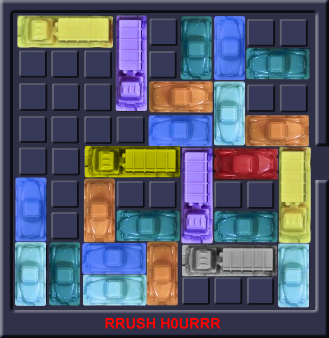
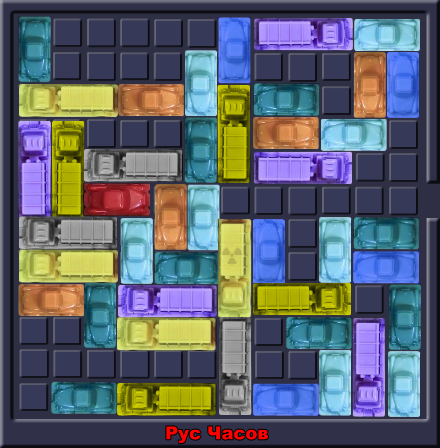

# Case: Rush Hour
{:.inline}

Rush Hour is een ogenschijnlijk eenvoudig puzzeltje met een verrassend uitdagend karakter. In een veld van 6 hoog en 6 breed staat een rode auto, de jouwe, en die moet naar de uitgang. die recht voor je ligt. Maar andere voertuigen versperren de weg; auto's van twee eenheden lang en trucks van drie eenheden lang, die alleen in hun rijrichting bewogen mogen worden. Ze mogen niet draaien. De opdracht is simpel: beweeg je auto naar buiten, of beter: schrijf een computerprogramma om dat voor je te doen.

## Opdracht
1. Los [games 1, 2 en 3](gameboards.zip) op. Doe hoe je dat goed lijkt. 
Het is natuurlijk goed om daar een programma voor te schrijven, maar als je een ander idee hebt, of het met de hand kunt, mag dat ook.
Let er op dat de _row_ en _column_ waarden beginnen vanaf 1 en niet vanaf 0!

Game #1

Game #2

Game #3

{:start="2"}
2. Verzin een implementatie voor het bord, en schrijf een algoritme dat series van zetten uitvoert. Laat het algoritme [games 4, 5 en 6](gameboards.zip) oplossen. Kortere series zijn betere series.

Game #4

Game #5

Game #6

{:start="3"}
3. Los [game 7](gameboards.zip) op. Pas je algoritme aan indien dat nodig is.

Game #7

## Advanced
{:start="4"}
4. Maak random Rush Hour borden en probeer ze op te lossen met je algoritmes.
5. Probeer te achterhalen wat het verschil is tussen een moeilijke rushhour-opgave en een even grote makkelijk rushhour opgave. Ook aantonen waar de moeilijkheid **niet** aan ligt is waardevol.

## Output
Om resultaten te kunnen verifiëren is het handig om in een uniform format je output te genereren.
Bekijk [het voorbeeld](example_output.csv) en zorg ervoor dat jouw programma een oplossing in hetzelfde format kan omzetten.
De enige vereiste aan de output is de header-regel (regel 1), die identiek moet zijn.
Bewegingen naar boven/rechts worden met een positief getal aangeduid en bewegingen 'de andere kant' op worden met een negatief getal aangeduid. 
Het getal geeft het aantal posities aan dat de auto opschuift.
N.B. Je programma hoeft hier verder niets mee te doen. Het programma hoeft dit enkel als laatste stap in het process te kunnen doen.

## Check50
Je kan je programma's testen door de output mee te geven aan de check50. Dit kan in drie eenvoudige stappen:
1. Genereer een antwoord en sla deze met het bovenstaande formaat op in een nieuw bestand met de naam `output.csv`
2. Open een terminal in de folder waar je `output.csv` hebt opgeslagen
3. Run het commando van het betreffende probleem:
    1. Voor de 6x6 borden: 
        1. `check50 okkevaneck/check50_heuristieken/master/rush_hour/board6x6_1`
        2. `check50 okkevaneck/check50_heuristieken/master/rush_hour/board6x6_2`
        3. `check50 okkevaneck/check50_heuristieken/master/rush_hour/board6x6_3`
    2. Voor de 9x9 borden: 
        1. `check50 okkevaneck/check50_heuristieken/master/rush_hour/board9x9_4`
        2. `check50 okkevaneck/check50_heuristieken/master/rush_hour/board9x9_5`
        3. `check50 okkevaneck/check50_heuristieken/master/rush_hour/board9x9_6`
    3. Voor het 12x12 bord: 
        1. `check50 okkevaneck/check50_heuristieken/master/rush_hour/board12x12_7`
