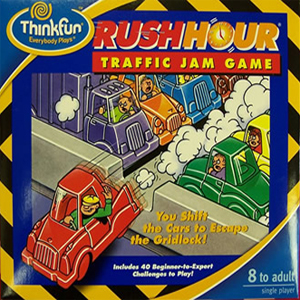

## Inleiding

Rush Hour is een ogenschijnlijk eenvoudig puzzeltje met een verrassend uitdagend karakter. In een veld van 6 hoog en 6 breed staat een rode auto, de jouwe, en die moet naar de uitgang. die recht voor je ligt. Maar andere voertuigen versperren de weg; auto's van twee eenheden lang en trucks van drie eenheden lang, die alleen in hun rijrichting bewogen mogen worden. Ze mogen niet draaien. De opdracht is simpel: beweeg je auto naar buiten, of beter: schrijf een computerprogramma om dat voor je te doen.

## Opdracht

1. Los op games 1,2 en 3 op. Doe hoe je dat goed lijkt. Het is natuurlijk goed om daar een programma te schrijven, maar als je een ander idee hebt, of het met de hand kunt, mag dat ook.

 Game #1
 Game #2
 Game #3

{:start="2"}
2. Verzin een implementatie voor het bord, en schrijf een algoritme dat series van zetten uitvoert. Laat het algoritme games 4, 5 en 6 oplossen. Kortere series zijn betere series.

 Game #4
 Game #5
 Game #6

{:start="3"}
3. Los game 7 op. Pas je algoritme aan indien dat nodig is.

 Game #7

## Advanced

{:start="4"}
4. Maak wat random Rush Hour borden en probeer ze op te lossen met je algoritmes.

5. Probeer te achterhalen wat het verschil is tussen een moeilijke rushhour-opgave en een evengrote makkelijk rushhour opgave. Ook aantonen waar de moeilijkheid **niet** aan ligt is waardevol.