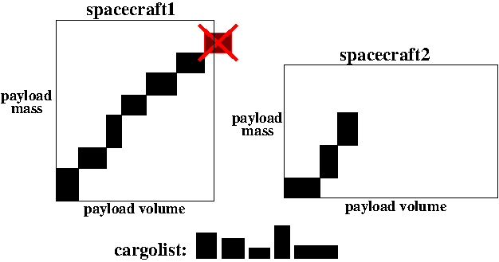

## Inleiding

Het International Space Station (ISS) is zo groot dat je het met het blote oog vanaf het aardoppervlak kunt zien. Het wordt gebruikt voor observatie, educatie en wetenschappelijk onderzoek, maar vervult als samenwerkingsconsoritum van 26 landen ook een belangrijke diplomatieke functie. Het werk in ISS is erg duur; de totale kosten zijn inmiddels 150 miljard, en het meerendeel daarvan kom op conto van de enorme transportkosten van mensen en goederen. De samenwerkende landen willen daar wat aan doen.

Drie landen lanceren regelmatig spacecrafts voor het  transport. Elke parcel in een transport heeft zijn eigen massa en volume. Om de kosten te beperken worden alle parcels ge-anonimiseerd en krijgen dezelfde prioriteit. Waar het dan eigenlijk op neerkomt, zo redeneert men, is om de parcels in de [cargolists](CargoLists.zip) zo goed mogelijk te verdelen over de spacecrafts zodat de kosten geminimaliseerd worden. De eigenschappen van de spacecrafts zijn zoals in onderstaande tabel.

| Spacecraft | Nation | Payload Mass (kg) | Payload Volume (m3) | Mass (kg) | Base Cost($) | Fuel-to-Weight |
| --- | --- | --- | --- | --- | --- | --- |
| Cygnus | USA | 2000| 18.9| 7400| 390M| 0.73
| Progress | Russia | 2400 | 7.6 | 7020 | 175M | 0.74
| Kounotori | Japan | 5200 | 14 | 10500 | 420M | 0.71
| Dragon | USA | 6000 | 10 | 12200 | 347M | 0.72

De totale massa en het totale volume van de parcels die een spacecrafts meeneemt mag de 'Payload Mass' en 'Payload Volume' van het spacecraft niet overschrijden zoals schematisch weergegeven in onderstaand figuur. De kosten van het transport komen voort uit de "Base Cost" voor iedere keer dat een spacecraft gebruikt wordt. Daar komen de brandstofkosten bij die worden bepaald door de "Fuel-to-Weight" (FtW) ratio van elk spacecraft. De dure brandstof kost $1 per gram.

## Voorbeeld

Stel we gebruiken alleen de Cygnus met een eigen massa van 7400 kilo en doen daar 1990 kilo aan parcels bij die qua volume in de Cygnus passen. Het aantal kilo brandstof wat met FtW=0.73 nodig is, komt dan op:

$$ (7400+1990) x 0.73 = 6854.7 kg brandstof $$

Maar deze brandstof moet zelf *ook* mee dus de totale massa wordt daardoor 7400+1990+6854.7 kg, waardoor weer meer brandstof nodig is:

$$ (7400+1990+6854.7) x 0.73 = 11858.631 kg brandstof $$

Om nu te bepalen hoeveel kg brandstof (F) we uiteindelijk nodig hebben voor een spacecraft gebruiken we deze afleiding:

$$
    (Mass + Payload-mass + F ) x FtW           = F
    (Mass + Payload-mass)      x FtW + F x FtW = F
    (Mass + Payload-mass)      x FtW           = (1-FtW) x F
    <b>(Mass + Payload-mass)      x FtW / (1-FtW) = F</b>
$$

Het aantal kilogram brandstof voor het voorbeeld komt daarmee op:

$$
    (7400 + 1990) x 0.73 / (1-0.73) = 25387.7777777... kg brandstof
$$

Omdat de totale hoeveelheid brandstof over alle spacecrafts per gram wordt ingekocht en de kosten $1 per gram zijn, komen de kosten van het voorbeeld in totaal op:

$$
    Base cost + roundup( F x 1000 ) = ...          ,functie roundup() rond altijd naar boven af
    390000000 +      25387778       = $415387778
$$

## Opdracht

1. Verdeel de parcels van cargolist 1 over de vier spacecrafts. Is het mogelijk om 97 parcels mee te nemen?

2. Wat is de grootste set van parcels van cargolist 1 dat kan worden verdeeld over de vier spacecrafts? Geef een zo goedkoop mogelijke verdeling als er meerdere sets van maximale grootte mogelijk zijn.

3. Doe hetzelfde voor cargolist 2. Wat is de grootste set van parcels van cargolist 2 dat kan worden verdeeld over de vier spacecrafts? Geef een zo goedkoop mogelijke verdeling als er meerdere sets van maximale grootte mogelijk zijn.

Er zijn nieuwe spelers in aantocht. De Chinezen hebben tegenwoordig een ruimteprogramma en ook stelt Europa nu een groot spacecraft beschikbaar om cargo naar het ISS te vervoeren. Omdat de Chinezen toetreden betekent dat dat er een extra module aan het ISS gekoppeld moet worden. Deze mega-operatie vereist veel parcel transportaties.

| Spacecraft | Nation | Payload mass (kgs) | Payload (m3) | Mass (kgs) | Base Cost($) | Fuel-to-Weight |
| --- | --- | --- | --- | --- | --- | --- |
| TianZhou | China | 6500 | 15 | 13500 | 412M | 0.75 |
| Verne ATV | Europe | 7500 | 48 | 20500 | 1080M | 0.72 |

{:start="4"}
4. Stel zelf een vloot samen met spacecrafts van de vijf partners voor de kolossale cargolijst 3 waarbij je spacecrafts meerdere keren mag inzetten. Verdeel de parcels goed over de spacecrafts. Hoe goedkoper het transport, hoe beter.

De vijf partners hebben voor cargolijst 3 een politieke constraint afgesproken waarbij ze allemaal ongeveer evenveel spacecrafts inzetten. Het verschil tussen partners mag maximaal één zijn. Dus als bijvoorbeeld Rusland twee spacecrafts stuurt, dan stuurt Europa er minimaal één en maximaal drie. 

{:start="5"}
5. Stel met inachtname van deze politieke constraint een vloot samen en verdeel de parcels om de kosten van het transport van cargolijst 3 te minimaliseren.

## Advanced

* Genereer zelf een aantal random ladingen. Voor welke ladingen is het moeilijk een optimaal lanceerprogramma te bedenken?

## Links & Trivia

De eerste versie van deze case is ontwikkeld in januari 2017.

Referenties voor gebruikte massa en volume van spacecrafts: [Cygnus](https://en.wikipedia.org/wiki/Cygnus_(spacecraft)), 
[Progress](https://en.wikipedia.org/wiki/Progress_(spacecraft)),
[Tianzhou](https://en.wikipedia.org/wiki/Tianzhou_(spacecraft)),
[Dragon](https://en.wikipedia.org/wiki/SpaceX_Dragon),
[Jules Verne ATV](http://www.spaceflight101.net/atv-spacecraft-information.html)
