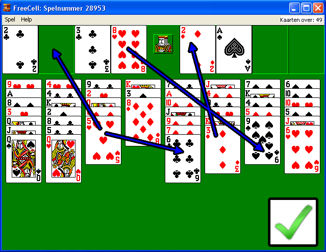
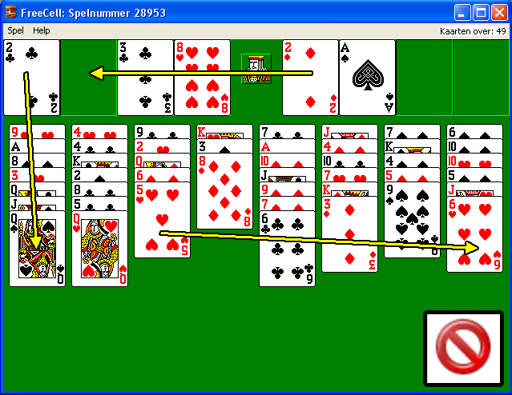

## Inleiding

FreeCell is een patiencegame die gratis met Windows en Unix wordt meegeleverd. De beginconditie bestaat uit acht random stacks: vier van zeven kaarten en vier van acht kaarten en het doel is alle kaarten weg te spelen naar de goal cells. FreeCell is helemaal niet makkelijk, en een prikkelende frase uit de manual luidt: 

*It is thought, though not proven, that every game of FreeCell can be won.*

Spannende claim, maar is hij ook waar?

## Regels

Een zet bestaat uit het verleggen van een kaart naar:

1. een FreeCell (linksboven) 

2. een GoalCell (rechtsboven) 

3. een andere kaart op een stack (onder) 

In geval twee mag een kaart alleen op de direct lagere kaart van zijn eigen vierkleur liggen (ruiten/harten/klaver/schoppen). In geval drie mag de kaart alleen op een direct hogere kaart van een andere tweekleur liggen (rood/zwart). Oftewel, bij de goalcells zijn kaarten gesorteerd naar ruiten/harten/klaver/schoppen, en op de stack wisselen rood en zwarte kaarten elkaar af.

Eenmaal in een GoalCell komt een kaart er niet meer uit. GoalCells worden dus op vierkleur en volgorde gesorteerde kaartenstapeltjes. Als alle kaarten in een GoalCell liggen is het spel gewonnen. 

De beste manier om deze opdracht aan te gaan is een aantal spelletjes FreeCell te spelen om *fingerspitzengefühl* te ontwikkelen. Wees voorzichtig: verslaving ligt op de loer. 

## Opdracht

De opdracht is een FreeCell-Solver te maken, die vanuit een gegeven positie tenminste tien kaarten wegspeelt. 

## Advanced

Verbeter je algoritme zodat het vanuit een beginpositie het hele spel oplost.

## Legal & illegal moves

## Resources

Er is source code en een online versie beschikbaar, maar waar die precies gebleven zijn is even een raadsel. Work in progress. Aha, hier dus: [code](http://wiki.phoib.net/resources/FreeCellSource.rar).

## Links

[Videootje van de game](http://www.firstpost.com/topic/person/the-game-vrije-gazellen-freecell-gui-video-cbJgDOTAkMQ-48466-4.html)

[Werk van de VU-studenten](http://skoonhoven.net/freecell/indexEN.php)
