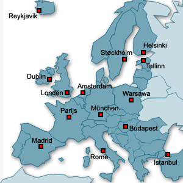
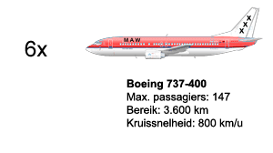

 

## Inleiding

De nieuw opgerichte Nederlandse maatschappij Mokum Airways (MAW) Amsterdam als thuisbasis en landingsrechten voor 21 verschillende bestemmingen, allen in Europa. Ze heeft een herkenbaar logo en een luchtvloot, bestaande uit toestellen van het type Boeing 737-400 (zie afbeelding onder). Mokum Airlines heeft een marktonderzoek gedaan voor de luchthavens waarop zij actief is waarbij gekeken is hoeveel mensen er potentieel tussen twee luchthavens vervoerd zouden kunnen worden door Mokum Airways.

## Opdracht

 
Het doel van deze opdracht is een 'dienstregeling' op te stellen zodat er zoveel mogelijk passagiers vervoerd worden. Mokum Airways maakt winst door zoveel mogelijk passagiers over zoveel mogelijk afstand te vervoeren. Dus wanneer een vliegtuig 10 passagiers 10 kilometer vervoert heeft, dan bedraagt het totaal aantal passagiers-kilometers 100. Maar passagiers gaan niet extra betalen om ver om te vliegen. Dus als een passagier van Amsterdam naar München vliegt via een omweg, telt de afstand Amsterdam-München, niet de omweg. 

1. Maak een correcte dagroute voor één vliegtuig, zodat er zoveel mogelijk passagiers over zoveel kilometers verplaatst worden. De score voor een schema is het aantal passagiers vermenigvuldigd met het aantal kilometers tussen haar start- en eindpunt.

2. Maak een correct dagschema voor ''alle zes'' de vliegtuigen uit de vloot, zodat er zoveel mogelijk passagiers over zoveel kilometers verplaatst worden. De score voor een schema is het aantal passagiers vermenigvuldigd met het aantal kilometers tussen haar start- en eindpunt. 

## Advanced

Mokum airlines zoekt een nieuwe thuishaven om haar passagierskilometers verder te optimaliseren. Is er een betere thuishaven dan Amsterdam te vinden? Geef een gegrond advies. 

## Technische Requirements

Een correcte dagroute voor een vliegtuig voldoet aan de volgende eisen:

* Het begin- en eindpunt zijn gelijk.
* Het vliegtuig komt vanwege personeelswissels tenminste éénmaal in Amsterdam.
* Het vliegtuig landt niet en stijgt niet op tussen 2:00 en 6:00 's nachts
* Een vliegtuig heeft een maximumcapaciteit van 147 personen
* Een vliegtuig kan maximaal 3600 kilometer vliegen op een volle tank, en mag onder geen beding zonder brandstof raken.
* Een vliegtuig heeft tussen twee luchthavens een gemiddelde snelheid van 800 km/u

* Een vliegtuig moet na een landing een uur blijven staan voor unboarding, schoonmaak en boarding alvorens weer op kunnen stijgen. 
* Een vliegtuig kan op een luchthaven voltanken, maar moet dan een uur extra blijven staan.

## Resources

**Nota Bene'** Je moet aardig kunnen progammeren om deze opdracht te kunnen doen; ondanks het voortreffelijke werk van Ruben Balk is de opgave wat ingewikkelder uitgepakt dan aanvankelijk voorzien. Ze staat op de nominatie om integraal omgebouwd te worden tot simulator.

Er is [java-sourcecode](http://wiki.phoib.net/resources/GlobalTraffic_Sourcecode.zip) beschikbaar die je kunt gebruiken, zodat je je kunt richten op het maken van het algoritme. De code bevat bijvoorbeeld al een representatie, methoden om die representatie te veranderen, methoden om een route af te drukken en methoden om het aantal passagiers-kilometers te berekenen. Die code maakt gebruik van een applet, en daarom kan je de code niet aanroepen in de commandline als "java globalTraffic" maar met "appletviewer globalTraffic.html". Je kunt uiteraard ook eclipse of een andere omgeving gebruiken.

Ook kan je, nadat je de java files gecompiled hebt, het globalTraffic.html bestandje direct openen in je browser. In dit geval hoef je dus geen gebruik te maken van appletviewer.

In principe waakt de code niet voor constraint violations. Dus het checkt niet op begin- en eindpunt, duur van een route, bereik en of Amsterdam bezocht wordt. Sterker nog, het is mogelijk routes te maken die bestaan uit: Amsterdam -> Amsterdam -> Amsterdam etc. Er wordt echter WEL een melding gegeven wanneer een vliegtuig naar een plek wil vliegen die verder weg ligt dan zijn bereik (dus ookal heeft het vliegtuig een volle tank). Het blijft enkel een melding, je moet zelf er dus voor zorgen dat er aan de constraints voldaan wordt.

De applet bestaat uit een kaartje waarop de routes getekend worden. Wanneer meerdere vliegtuigen tussen twee steden gevlogen hebben, dan kan je alleen de lijn zien van het vliegtuig dat het laatst getekend is.

Verder zie je een scrollbar waarmee je de tijdlijn in en uit kunt zoomen. Daarnaast een redraw knop die een nieuwe route maakt en ook aan het begin ervoor zorgt dat het kaartje afgebeeld wordt.

De tijdlijn geeft de meeste informatie. Elke rij staat voor een vliegtuig en elk vliegtuig heeft een eigen kleur. Daarnaast zie je de duur in minuten van de route die het vliegtuig vliegt. Vervolgens zie je de beginstad van het vliegtuig en pas vanaf 6 uur begint de daadwerkelijke route. Eerst de grondtijd (in de kleur van de stad). Dan zie je in het grijs de tijd dat het vliegtuig in de lucht is. Elke landing is een balkje in de kleur van de stad. Een witte omlijning geeft de minimale grondtijd aan van het vliegtuig. Als het gekleurde balkje verder gaat dan deze gekleurde omlijning, dan is dit dus de extra grondtijd. Wanneer een vliegtuig tankt zie je geen witte omlijning maar rode omlijning. Als de ruimte het toelaat kun je de totale grondtijd in minuten zien tussen de haakjes achter de naam van de stad.

## Known Issues Source Code

* In `MokumFrame.java` staan de volgende regels verwisseld:

        29: GlobalTraffic traffic = new GlobalTraffic(schaal, redrawButton);

        31: redrawButton = new Button("Redraw!");

* De afstand tussen steden hoort symmetrisch te zijn. Enkel in `Landing.java` is de int 2d-array AFSTAND dat niet voor Amsterdam-Athene:2163 en Athene-Amsterdam:2161.