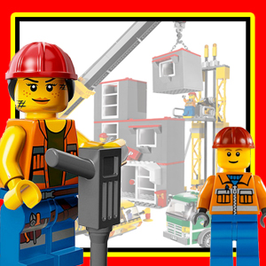
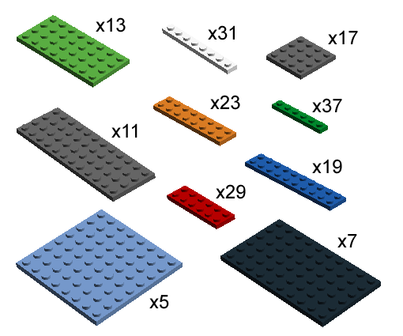

## Inleiding

Want spelen met Lego is fijn. Voor kinderen, maar ook voor grote kinderen op de universiteit. 

## Opdracht

Je kunt Lego gebruiken om gebouwen van meerdere verdiepingen mee te maken. Iedere verdieping van het Lego-gebouw is een rechthoek van twee lagen dik, opgebouwd uit platte legosteentjes. Je hoeft geen muren te maken, alleen maar vloerlagen. De opdracht is een aantal verdiepingen met een zo groot mogelijke vloeroppervlakte te realiseren en de vereisten zijn als volgt:

1. Het gebouw bestaat uit minimaal één en maximaal vijf verdiepingen.

2. Een maximale lengte van een verdieping is 25, de maximale breedte is 15.

3. De verdiepingen hoeven niet even groot te zijn, dat is in New York ook niet zo, maar een grotere verdieping mag nooit op een kleinere staan. Beter gezegd: van een verdieping mag zowel de lengte als de breedte onder geen beding groter zijn dan die van de verdieping eronder.

4. Iedere verdieping bestaat uit twee evengrote rechthoeken van legosteentjes. De rechthoeken zijn perfect, dus geen gaatjes, uitsteekseltjes of randjes die er niet horen.

5. De score voor de opdracht is zo goed als het totaal gerealiseerde vloeroppervlak. Dat betekent niet dat dat ook automatisch overeenkomt met je cijfer, want we weten niet hoe moeilijk deze opdracht is, en hoe hoog de score kan worden.

## Advanced

Verwijder één steentje uit de set en maak opnieuw verdiepingen. Leg het steentje terug, en verwijder een ander steentje. Welk steentje heeft de grootste impact op de totaal gerealiseerde oppervlakte? Welke op het totaalarrangement?
