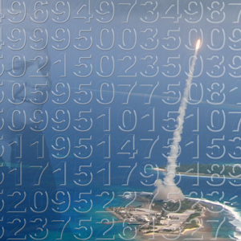

## Inleiding

De basisingredienten van deze opgave zijn het begingetal 4 en drie operatoren: de faculteit, de vierkantswortel en de floor-functie, in het nederlands beter bekend als 'afronden naar beneden'. Er bestaat een hypothese dat alle natuurlijke getallen met deze drie operatoren uit het begingetal gemaakt kunnen worden. We gaan deze hypothese testen, en hopelijk een klein beetje vordering maken in het oplossen van dit vraagstuk.

## Opdracht

1. Maak de getallen 1,2,5 en 24 met deze operatoren uit het begingetal. Noteer de operatorensequentie die nodig is om ieder getal te maken. Doe hierna hetzelfde voor de getalen 6, 10, 26 en 30.

2. Schrijf een algoritme (als je dat nog niet gedaan had) om verschillende operatorsequenties op je begingetal uit te proberen. Maak de getallen 43, 44, 46 en X. Noteer wederom de operatorsequentie. Test je algoritme goed, een foutje is in dit soort programma's gauw gemaakt.

3. Zorg dat je algoritme alle getallen onder de 100 vindt. Documenteer goed hoe je dit doet. Op tijd van schrijven is er zo weinig bekend over deze casus dat je best eens nieuwe dingen zou kunnen ontdekken.

4. Vind zoveel mogelijk getallen onder de 10 000. Wat is de *minimale* operatorsequentie die nodig is voor ieder getal? probeer een beeld te schetsen welke van deze getallen dichtbij je begingetal liggen. Probeer ook iets te zeggen over de overeenkomsten in operatorsequenties.

## Advanced

Kies uit elk van de onderstaande boxen één functie of getal en bepaal de kortste operatorsequenties voor de getallen 1-100. Welke combinatie  begingetal+operatorset levert de kortste gemiddelde operatorsequentie voor de getallen 1-100?

| Box 1 | | Box 2 | | Box 3 | | Box 4 |
| --- | --- | --- | --- | --- | --- | --- |
| n faculteit  | (n!)* | wortel | (√n) | afronden naar beneden | (floor) | 4 |
| som van 1 tot n  | (∑n)* | 17de machtswortel | (17√n) | afronden naar boven | (ceiling) | 7 |
| 3 tot de n-de  | (3n) | ln | (ln = loge) | 'normaal' afronden | (round) | 97 |

(*) = Let erop dat deze functies alleen gehele getallen accepteren.