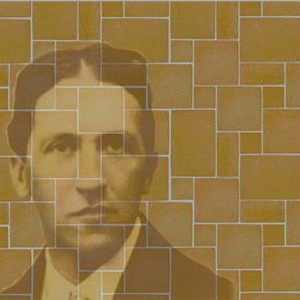
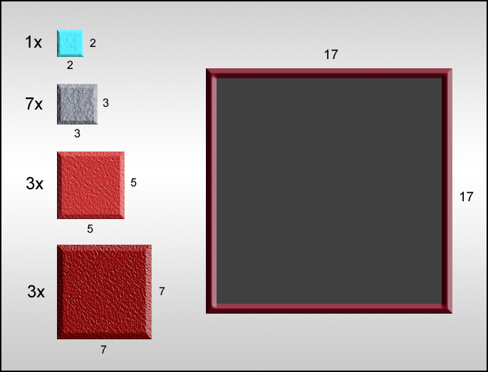
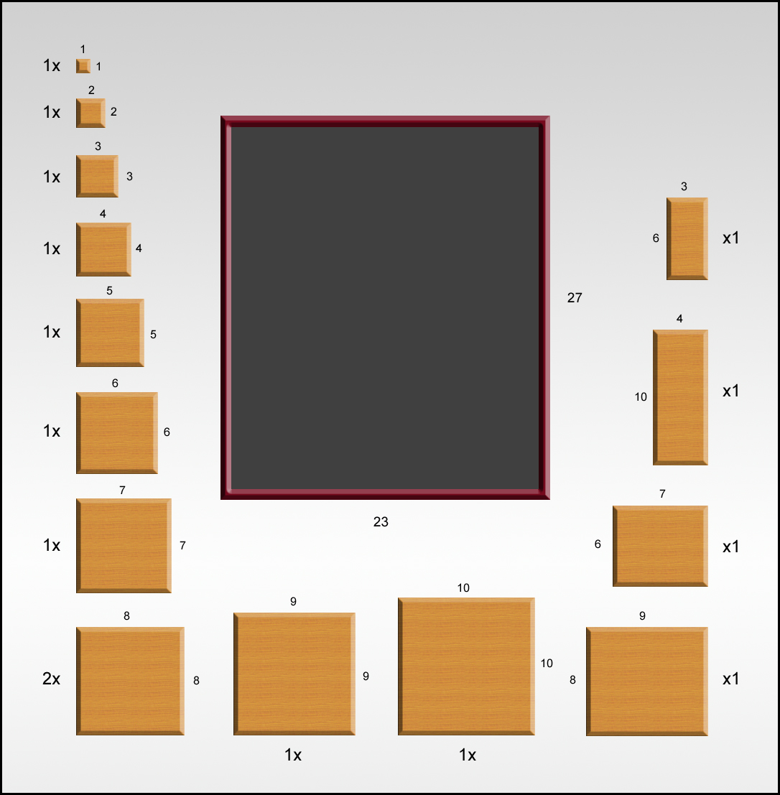
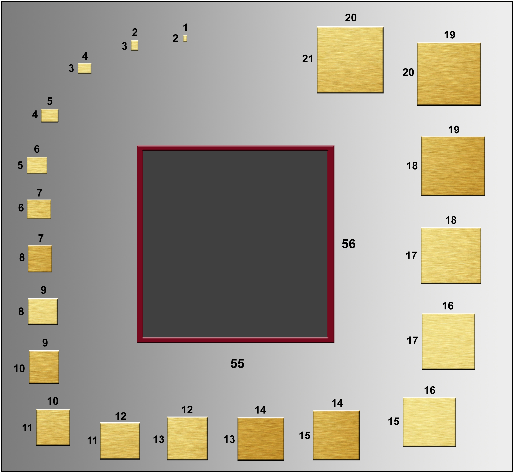

## Inleiding

Tegelzetten is een vak apart. Hoewel de meeste zettingen regelmatig zijn (denk aan de vierkantjes in keuken en badkamer) zijn er ook ambitieuzere patronen, zoals een Versailles-patroon waarin twee of drie verschillende tegeltjes in een veelal herhalend patroon worden gerangschikt. In een zeldzaam geval is de zetting echt onregelmatig, en is de kunstenaar of architect veel tijd kwijt aan het in elkaar puzzelen. 

In deze opdracht zul je een algoritme ontwikkelen om tegelsets van oplopende moeilijkheid in elkaar te zetten.

## Opdracht

1. Verzin een algoritme om tegelset #1 in het bijgeleverde invoervak te zetten. Een zetting is correct als er geen tussenruimte tussen de tegels is, en tegels elkaar niet overlappen.

2. Verzin een algoritme om tegelset #2 in het bijgeleverde invoervak te zetten. Een zetting is correct als er geen tussenruimte tussen de tegels is, en tegels elkaar niet overlappen. Tegels hoeven niet gedraaid te worden.

3. Verzin een algoritme om tegelset #3 in het bijgeleverde invoervak te zetten. Een zetting is correct als er geen tussenruimte tussen de tegels is, en tegels elkaar niet overlappen.

## Advanced

{:start="4"}
4. Er zijn [nieuwe tegelsets](NieuweTegelsets_okt2015.xlsx) beschikbaar gemaakt door onze collega's van de VU, maar zijn ze eigenlijk wel oplosbaar?

5. En ook de docent doet een duit in het zakje met [14 nieuwe tegelsets](http://www.heuristieken.nl/resources/MeerNieuweTegelsets_okt2015.xlsx). Ook hiervan weten we niet of ze wel een oplossing hebben. Spannend.

## Links

Best leuk om even te kijken naar perfect squares op [http://mathworld.wolfram.com/PerfectSquareDissection.html WolframMathWorld].
