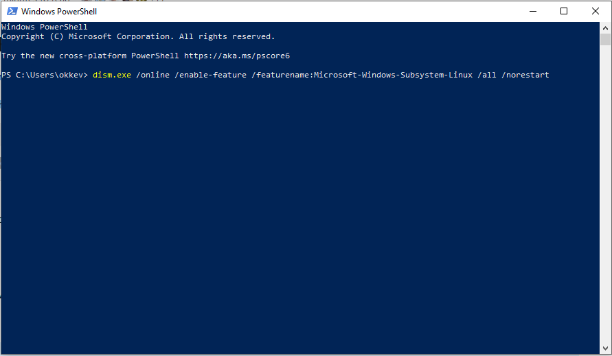

# Check50 installatie
Voor alle cases is er een check50 ontworpen: een script waarmee je de output van je programma's kan testen.
De scripts zijn voor iedere case anders, dus zal je het ook op andere manier moeten aanroepen.
Dit kan je vinden op de pagina van jouw case.
Hieronder staat hoe je check50 moet installeren om zo gebruik te maken van de scripts.
Afhankelijk van je bestuuringssysteem zullen er andere stappen gemaakt moeten worden.
Daarom hebben alle besturingssystemen hun eigen sectie.


## Windows
Voor Windows moet eerst Windows Subsystem for Linux (WSL 1) geïnstalleerd worden.
Vervolgens kunnen we Ubuntu installeren en met een terminal check50 installeren.

#### Windows Subsystem for Linux
Windows Subsystem for Linux kan geactiveerd en geïnstalleerd worden met een paar simpele commando's.

1. Activeer de optie met een terminal.
    1. Open PowerShell als administrator en run:
        ```powershell
        dism.exe /online /enable-feature /featurename:Microsoft-Windows-Subsystem-Linux /all /norestart
        ```
         
    
    {: start="2"}
    2. Start vervolgens de computer opnieuw op.
    
#### Installeer Ubuntu

{: start="2"}
2. Installeer Ubuntu via de Microsoft Store.
    1. Open de Microsoft Store en zoek naar Ubuntu.
    2. Selecteer `Ubuntu` (dus zonder versie erachter!) en installeer de applicatie door op de `Get` knop te klikken.
    
3. Start de Ubuntu applicatie op en wacht tot de installatie voltooid is.
4. Geef een gebruikersnaam en wachtwoord op die je gaat gebruiken voor het Ubuntu besturingssysteem.
Dit account zal alle administrator rechten krijgen binnen Ubuntu.
5. Update Ubuntu door de volgende regel uit te voeren in de terminal:
```bash
sudo apt update && sudo apt upgrade
```
 
#### Installeer Python, Pip & check50
Met de volgende stappen installeren we check50. 
Dit gebeurd allemaal binnen het Ubuntu besturingssysteem waar je in komt door de Ubuntu applicatie op te starten.

{: start="6"}
6. Installeer Python en Pip voor het Ubuntu besturingssyteem met: 
    ```bash
    sudo apt install python3 python3-pip
    ```  
7. Open een terminal en installeer check50 met:
    ```bash
    pip3 install check50
    ```    

Vervolgens kan je de check50 scripts uitvoeren zoals aangegeven bij de door jou gekozen case.


## macOS
Alle installaties worden in de terminal gedaan.
Deze kan je met Spotlight openen door `⌘CMD + spatie` in te drukken en vervolgens op 'terminal' te zoeken.

#### Installeer CLT & Homebrew
De eerste stappen zijn het installeren van de Command Line Tools en Homebrew, die je nodig gaat hebben voor het installeren van de software.

1. Installeer Command Line Tools met:
    ```bash
    xcode-select --install
    ```
2. Ga naar de [Homebrew](https://brew.sh/) website en copy-paste het "Install Homebrew" commando in de terminal.
Voer het commando uit door op enter te drukken, waarna Homebrew geïnstalleerd is.

#### Installeer Python & Pip

{: start="4"}
4. Vervolgens moeten we Python Pip installeren met:
    ```bash
    brew install python
    ```

Vervolgens kan je python gebruiken voor het runnen van code met het `python3` commando.
Als je extra python packages wilt installeren kan dat met het `pip3` commando.

#### Installeer check50

{: start="5"}
5. check50 is een python package en kan geïnstalleer worden met:
    ```bash
    pip3 install check50
    ```

Vervolgens kan je de check50 scripts uitvoeren zoals aangegeven bij de door jou gekozen case.


## Linux
Alle installaties worden in de terminal gedaan.
Deze kan je met Spotlight openen met de toetsencombinatie `ctrl + alt + t`.

1. Als eerste moeten Python en Pip geïnstalleerd worden met:
    ```bash
    sudo apt install python3 python3-pip
    ```
2. Nu kunnen we met pip het check50 pakket installeren:
    ```bash
    pip3 install check50
    ```

Vervolgens kan je de check50 scripts uitvoeren zoals aangegeven bij de door jou gekozen case.
