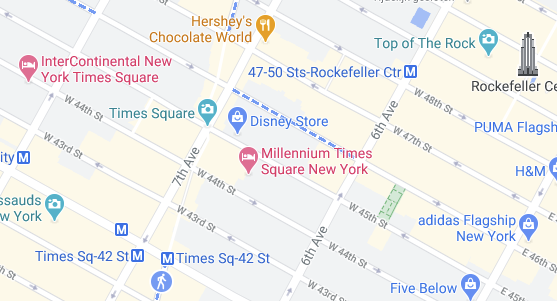

# State-space

Om je case beter te begrijpen en een idee te hebben hoe “groot” een probleem is, is het goed om een schatting te hebben van de grootte van de state-space van je case. Daarmee bedoelen we het aantal mogelijke staten in de case, of het aantal mogelijke oplossingen van de case. We kijken hiervoor naar het aantal (tussen)oplossingen die we moeten bekijken en evalueren om zeker te kunnen weten (bewijzen) dat we de optimale oplossing hebben gevonden.

Stel we hebben N studenten die op een bepaalde volgorde in een rij moeten staan. Voor iedere volgorde hebben we een puntentelling. De exacte werking van de puntentelling is niet belangrijk, we zijn alleen geïnteresseerd in de state-space van dit probleem. Bijvoorbeeld, in een case waar we de beste volgorde voor Anna, Bert, en Carlijn moeten vinden, zijn dit de mogelijkheden waarop ze in een rij kunnen staan: ABC, ACB, BAC, CAB, BCA, CBA. Zo zie je dat er zes mogelijkheden zijn.

Je kunt dit ook berekenen, want Anna kan op drie verschillende plekken staan, vervolgens kan Bert op de overige twee plekken staan, en tot slot Carlijn op de laatste plek. Vermenigvuldig je dit met elkaar, dus $$3 x 2 x 1$$ dan krijg je het aantal mogelijkheden: $$6$$ ofwel $$3!$$. Voor ons probleem in het algemeen, met N studenten, zou de state-space $$N!$$ zijn.

> Het kan voor je case erg moeilijk zijn om exact de grootte van de state-space te berekenen; vaak weet je helemaal niet hoe veel van de mogelijkheden nou daadwerkelijk mogelijk zijn. Daarom doen we aannames om deze berekening te versimpelen. Deze aannames kiezen we dan wel zo zodat we zeker weten dat het werkelijke aantal mogelijk staten hier gegarandeerd niet boven ligt. We noemen dit een bovengrens (upper-bound) van de grootte van de state-space. Hoe lager de bovengrens hoe beter!

## Combinaties en Permutaties

Om de grootte van de state-space te berekening is het nuttig om bekend te zijn met Combinaties en Permutaties. [Lees hier over Combinaties en Permutaties](https://www.mathsisfun.com/combinatorics/combinations-permutations.html)

Er zijn eigenlijk twee belangrijke aspecten om op te letten bij de berekening:

1. Order: Is de volgorde van de uitkomst belangrijk?
1. Repetition: Is het mogelijk om herhaaldelijk dezelfde keuze maken?

Op basis van deze twee aspecten vind je hieronder een kleine cheatsheet voor de berekening:

Het is ook belangrijk om $$N$$ en $$r$$ correct te bepalen. $$N$$ is het aantal mogelijkheden dat we hebben op het moment dat we de eerste keuze gaan maken. $r$ is het aantal keer dat we een keuze zullen maken.

> In het voorbeeld van de N studenten die we op volgorde zetten hierboven, is de volgorde belangrijk, en is het niet mogelijk om herhaaldelijk dezelfde keuze te maken. We maken dus gebruik van $$\frac{n!}{(n - r)!}$$. Als we dit invullen voor Anna, Bert, en Carlijn, krijgen we $$N=3$$ (we hebben 3 personen om uit te kiezen), en $$r=3$$ (we maken een rij van 3 personen). $$3 - 3 = 0$$, en $$0!=1$$, dus als we alles invullen krijgen we $$\frac{3!}{(3 - 3)!}=\frac{3!}{0!}=\frac{3!}{1}=3!=3*2*1=6$$.

Vaak helpt het om een probleem eerst te verkleinen en het dus eerst voor zeer kleine waarden voor `n` en `r` op te lossen waarbij je nog kunt natellen of het antwoord klopt!

## Opdrachten

Stel jezelf bij ieder van de opdrachten hieronder de volgende vragen:

* Is de volgorde van de uitkomst belangrijk?
* Is het mogelijk om herhaaldelijk dezelfde keuze maken?

Geef bij iedere opdracht zowel de formule als de uitkomst.

**Maar één persoon uit je team hoeft dit formulier in te leveren.** Het is natuurlijk wel de bedoeling dat jullie hier samen aan werken.

### Opdracht 1

Een student heeft 12 verschillende vakken van 2 uur welke geroosterd moeten worden van maandag t/m vrijdag in tijdsloten 9-11, 11-13, 13-15, 15-17. Hoeveel verschillende roosters zijn er mogelijk voor deze student zonder overlap van vakken?

<textarea name="form[q1]" rows="2" required></textarea>

### Opdracht 2

Je fietst door Manhattan, New York en kunt bij elk kruispunt linksaf, rechtsaf of rechtdoor. Hoeveel verschillende routes kun je rijden vanaf een gegeven beginpunt en richting met daarin 20 kruispunten?

<textarea name="form[q2]" rows="2" required></textarea>

### Opdracht 3

Er moeten 50 dozen met flesjes water, 50 dozen fruit, en 30 dozen broodjes worden vervoerd. In de bestelbus passen 25 dozen. Hoeveel verschillende ladingen kun je in het eerste ritje meenemen als je een volle lading meeneemt?

<textarea name="form[q3]" rows="2" required></textarea>

### Opdracht 4

Om af te studeren moet een student 30 vakken hebben afgerond, maar een student mag er ook meer doen. Een student kan daarbij kiezen uit 110 verschillende aangeboden vakken. Op hoeveel verschillende manieren kan een student afstuderen met 30, 31 of 32 vakken?

<textarea name="form[q4]" rows="2" required></textarea>

### Opdracht 5

Een loterij heeft balletjes A t/m Z waaruit een notaris op volgorde 7 willekeurige balletjes trekt zonder terugleggen. Wat is de kans dat het lot met DBFAECG wint?

<textarea name="form[q5]" rows="2" required></textarea>

### Opdracht 6

Opnieuw moeten 50 dozen met flesjes water, 50 dozen fruit, en 30 dozen broodjes worden vervoerd. Je hebt nu een vrachtwagen waarin 45 dozen passen. Hoeveel verschillende ladingen kun je nu in het eerste ritje meenemen als je een volle lading meeneemt?

<textarea name="form[q6]" rows="2" required></textarea>

### Opdracht 7

Geef (de bovengrens van) de grootte van de state-space van de gekozen case.

Welke case heb je gekozen?

<textarea name="form[q7]" rows="1" required></textarea>

Welke variabelen zijn er in de case?

<textarea name="form[q8]" rows="4" required></textarea>

Beschrijf de eventuele versimpelende aannames die je maakt en waarom de werkelijke state-space grootte hier dan gegarandeerd nooit boven ligt.

<textarea name="form[q9]" rows="4" required></textarea>

Geef de formule voor de berekening van (de bovengrens van) de grootte van de state-space van je case.

<textarea name="form[q10]" rows="2" required></textarea>

Laat in een klein voorbeeld zien dat de formule klopt. Het kan makkelijker zijn om dit te schetsen. Plaatjes daarvan kan je uploaden en via een url hieronder met ons delen.

<textarea name="form[q11]" rows="4" required></textarea>

Bereken de grootte van de state-space voor één of meer van de probleem-instanties in de case.

<textarea name="form[q12]" rows="4" required></textarea>

> Kom je niet helemaal uit deze vragen? Stel een vraag aan een assistent!
